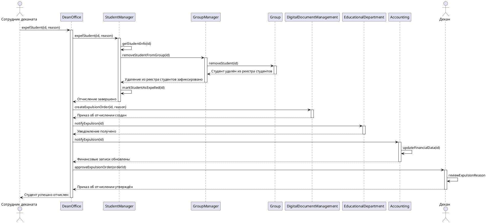

```plantuml
@startuml
actor "Сотрудник деканата" as DeanWorker
participant "DeanOffice" as DO
participant "StudentManager" as SM
participant "GroupManager" as GM
participant "Group" as G
participant "DigitalDocumentManagement" as DDM
participant "EducationalDepartment" as ED
participant "Accounting" as ACC
actor "Декан" as Dean

DeanWorker -> DO: expelStudent(id, reason)
activate DO

DO -> SM: expelStudent(id, reason)
activate SM

SM -> SM: getStudentInfo(id)
SM -> GM: removeStudentFromGroup(id)
activate GM

GM -> G: removeStudent(id)
activate G
G --> GM: Студент удалён из реестра студентов
deactivate G

GM --> SM: Удаление из реестра студентов зафиксировано
deactivate GM

SM -> SM: markStudentAsExpelled(id)

SM --> DO: Отчисление завершено
deactivate SM

DO -> DDM: createExpulsionOrder(id, reason)
activate DDM
DDM --> DO: Приказ об отчислении создан
deactivate DDM

DO -> ED: notifyExpulsion(id)
activate ED
ED --> DO: Уведомление получено
deactivate ED

DO -> ACC: notifyExpulsion(id)
activate ACC
ACC -> ACC: updateFinancialData(id)
ACC --> DO: Финансовые записи обновлены
deactivate ACC

DO -> Dean: approveExpulsionOrder(orderId)
activate Dean
Dean -> Dean: reviewExpulsionReason
Dean --> DO: Приказ об отчислении утверждён
deactivate Dean

DO --> DeanWorker: Студент успешно отчислен
deactivate DO
@enduml
```
