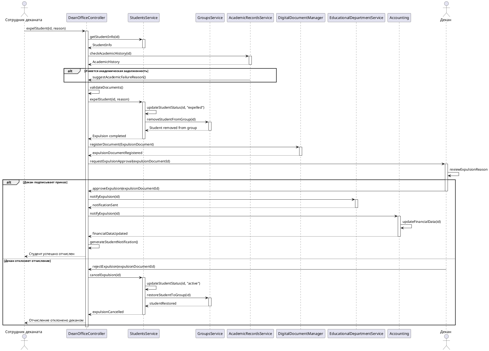

```plantuml
@startuml
actor "Сотрудник деканата" as DeanWorker
participant "DeanOfficeController" as DO
participant "StudentsService" as SS
participant "GroupsService" as GS
participant "AcademicRecordsService" as ARS
participant "DigitalDocumentManager" as DDM
participant "EducationalDepartmentService" as EDS
participant "Accounting" as ACC
actor "Декан" as Dean

DeanWorker -> DO: expelStudent(id, reason)
activate DO

DO -> SS: getStudentInfo(id)
activate SS
SS --> DO: StudentInfo
deactivate SS

DO -> ARS: checkAcademicHistory(id)
activate ARS
ARS --> DO: AcademicHistory
deactivate ARS

alt Имеется академическая задолженность
    ARS -> DO: suggestAcademicFailureReason()
end

DO -> DO: validateDocuments()

DO -> SS: expelStudent(id, reason)
activate SS

SS -> SS: updateStudentStatus(id, "expelled")

SS -> GS: removeStudentFromGroup(id)
activate GS
GS --> SS: Student removed from group
deactivate GS

SS --> DO: Expulsion completed
deactivate SS

DO -> DDM: registerDocument(ExpulsionDocument)
activate DDM
DDM --> DO: expulsionDocumentRegistered
deactivate DDM

DO -> Dean: requestExpulsionApproval(expulsionDocumentId)
activate Dean
Dean -> Dean: reviewExpulsionReason

alt Декан подписывает приказ
    Dean -> DO: approveExpulsion(expulsionDocumentId)
    deactivate Dean
    
    DO -> EDS: notifyExpulsion(id)
    activate EDS
    EDS --> DO: notificationSent
    deactivate EDS
    
    DO -> ACC: notifyExpulsion(id)
    activate ACC
    ACC -> ACC: updateFinancialData(id)
    ACC --> DO: financialDataUpdated
    deactivate ACC
    
    DO -> DO: generateStudentNotification()
    
    DO --> DeanWorker: Студент успешно отчислен
    
else Декан отклоняет отчисление
    Dean -> DO: rejectExpulsion(expulsionDocumentId)
    deactivate Dean
    
    DO -> SS: cancelExpulsion(id)
    activate SS
    SS -> SS: updateStudentStatus(id, "active")
    
    SS -> GS: restoreStudentToGroup(id)
    activate GS
    GS --> SS: studentRestored
    deactivate GS
    
    SS --> DO: expulsionCancelled
    deactivate SS
    
    DO --> DeanWorker: Отчисление отклонено деканом
end

deactivate DO
@enduml
```
