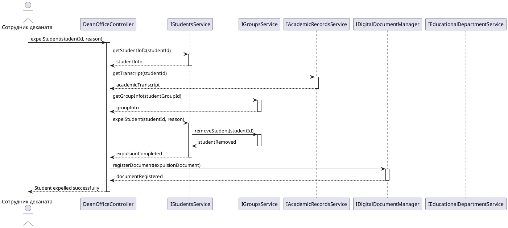

```plantuml
@startuml
actor "Сотрудник деканата" as DeanWorker
participant "DeanOfficeController" as DO
participant "IStudentsService" as ISS
participant "IGroupsService" as IGS
participant "IAcademicRecordsService" as IARS
participant "IDigitalDocumentManager" as IDDM
participant "IEducationalDepartmentService" as IEDS

DeanWorker -> DO: expelStudent(studentId, reason)
activate DO

DO -> ISS: getStudentInfo(studentId)
activate ISS
ISS --> DO: studentInfo
deactivate ISS

DO -> IARS: getTranscript(studentId)
activate IARS
IARS --> DO: academicTranscript
deactivate IARS

DO -> IGS: getGroupInfo(studentGroupId)
activate IGS
IGS --> DO: groupInfo
deactivate IGS

DO -> ISS: expelStudent(studentId, reason)
activate ISS

ISS -> IGS: removeStudent(studentId)
activate IGS
IGS --> ISS: studentRemoved
deactivate IGS

ISS --> DO: expulsionCompleted
deactivate ISS

DO -> IDDM: registerDocument(expulsionDocument)
activate IDDM
IDDM --> DO: documentRegistered
deactivate IDDM

DO --> DeanWorker: Student expelled successfully
deactivate DO
@enduml
```
