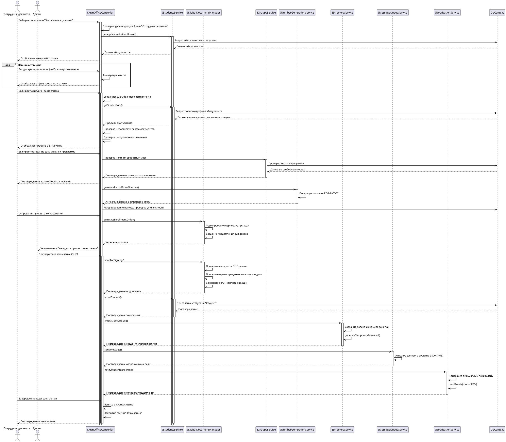

```plantuml
@startuml

actor "Сотрудник деканата" as Clerk
actor Декан as Dean
participant "DeanOfficeController" as Controller
participant "IStudentsService" as StudentsSvc
participant "IDigitalDocumentManager" as DocManager
participant "IGroupsService" as GroupsSvc
participant "INumberGenerationService" as NumberGen
participant "IDirectoryService" as Directory
participant "IMessageQueueService" as MessageQueue
participant "INotificationService" as Notification
participant "DbContext" as DB

Clerk -> Controller : Выбирает операцию "Зачисление студентов"
activate Controller
Controller -> Controller : Проверка уровня доступа (роль "Сотрудник деканата")
Controller -> StudentsSvc : getApplicantsForEnrollment()
activate StudentsSvc
StudentsSvc -> DB : Запрос абитуриентов со статусами
DB --> StudentsSvc : Список абитуриентов
StudentsSvc --> Controller : Список абитуриентов
Controller --> Clerk : Отображает интерфейс поиска

loop Поиск абитуриента
Clerk -> Controller : Вводит критерии поиска (ФИО, номер заявления)
Controller -> Controller : Фильтрация списка
Controller --> Clerk : Отображает отфильтрованный список
end

Clerk -> Controller : Выбирает абитуриента из списка
activate Controller
Controller -> Controller : Сохраняет ID выбранного абитуриента
Controller -> StudentsSvc : getStudentInfo()
activate StudentsSvc
StudentsSvc -> DB : Запрос полного профиля абитуриента
DB --> StudentsSvc : Персональные данные, документы, статусы
StudentsSvc --> Controller : Профиль абитуриента
Controller -> Controller : Проверка целостности пакета документов
Controller -> Controller : Проверка статуса отзыва заявления
Controller --> Clerk : Отображает профиль абитуриента

Clerk -> Controller : Выбирает основание зачисления и программу
Controller -> GroupsSvc : Проверка наличия свободных мест
activate GroupsSvc
GroupsSvc -> DB : Проверка квот на программу
DB --> GroupsSvc : Данные о свободных местах
GroupsSvc --> Controller : Подтверждение возможности зачисления
deactivate GroupsSvc
Controller --> Clerk : Подтверждение возможности зачисления

Controller -> NumberGen : generateRecordBookNumber()
activate NumberGen
NumberGen -> NumberGen : Генерация по маске ГГ-ФФ-СССС
NumberGen --> Controller : Уникальный номер зачетной книжки
deactivate NumberGen
Controller -> DB : Резервирование номера, проверка уникальности

Clerk -> Controller : Отправляет приказ на согласование
Controller -> DocManager : generateEnrollmentOrder()
activate DocManager
DocManager -> DocManager : Формирование черновика приказа
DocManager -> DocManager : Создание уведомления для декана
DocManager --> Controller : Черновик приказа
deactivate DocManager
Controller --> Dean : Уведомление "Утвердить приказ о зачислении"

Dean -> Controller : Подтверждает зачисление (ЭЦП)
activate Controller
Controller -> DocManager : sendForSigning()
activate DocManager
DocManager -> DocManager : Проверка валидности ЭЦП декана
DocManager -> DocManager : Присвоение регистрационного номера и даты
DocManager -> DocManager : Сохранение PDF с печатью и ЭЦП
DocManager --> Controller : Подтверждение подписания
deactivate DocManager
Controller -> StudentsSvc : enrollStudent()
activate StudentsSvc
StudentsSvc -> DB : Обновление статуса на "Студент"
DB --> StudentsSvc : Подтверждение
StudentsSvc --> Controller : Подтверждение зачисления
deactivate StudentsSvc

Controller -> Directory : createUserAccount()
activate Directory
Directory -> Directory : Создание логина из номера зачетки
Directory -> Directory : generateTemporaryPassword()
Directory --> Controller : Подтверждение создания учетной записи
deactivate Directory

Controller -> MessageQueue : sendMessage()
activate MessageQueue
MessageQueue -> MessageQueue : Отправка данных о студенте (JSON/XML)
MessageQueue --> Controller : Подтверждение отправки в очередь
deactivate MessageQueue

Controller -> Notification : notifyStudentEnrollment()
activate Notification
Notification -> Notification : Генерация письма/СМС по шаблону
Notification -> Notification : sendEmail() / sendSMS()
Notification --> Controller : Подтверждение отправки уведомления
deactivate Notification

Clerk -> Controller : Завершает процесс зачисления
Controller -> Controller : Запись в журнал аудита
Controller -> Controller : Закрытие сессии "Зачисления"
Controller --> Clerk : Подтверждение завершения

deactivate Controller
deactivate Controller
deactivate StudentsSvc

@enduml
```
