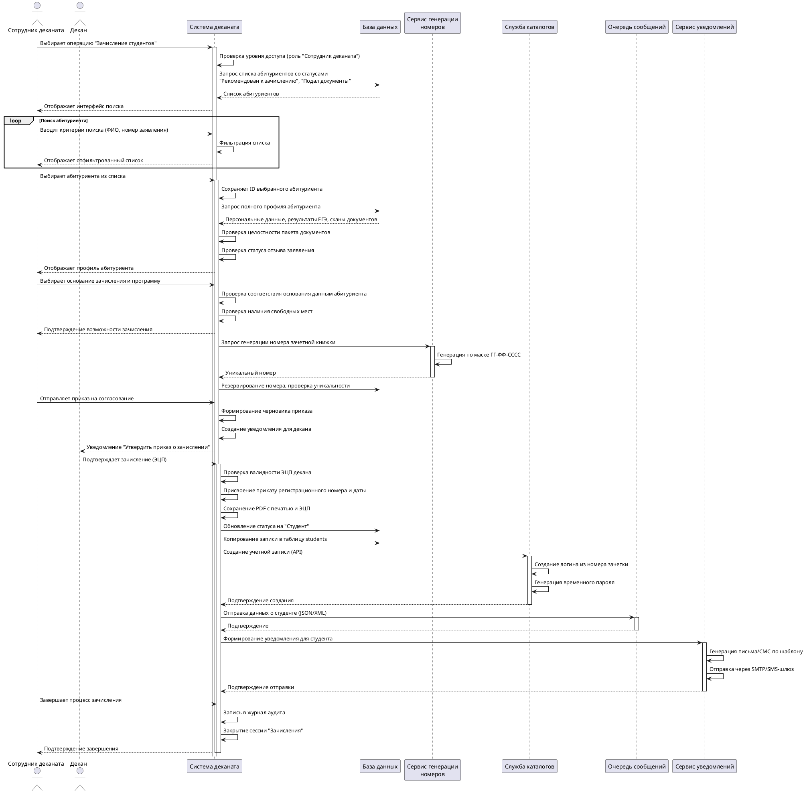

```plantuml
@startuml

actor "Сотрудник деканата" as Clerk
actor Декан as Dean
participant "Система деканата" as System
participant "База данных" as DB
participant "Сервис генерации\nномеров" as NumberGen
participant "Служба каталогов" as Directory
participant "Очередь сообщений" as MessageQueue
participant "Сервис уведомлений" as Notification

Clerk -> System : Выбирает операцию "Зачисление студентов"
activate System
System -> System : Проверка уровня доступа (роль "Сотрудник деканата")
System -> DB : Запрос списка абитуриентов со статусами\n"Рекомендован к зачислению", "Подал документы"
DB --> System : Список абитуриентов
System --> Clerk : Отображает интерфейс поиска

loop Поиск абитуриента
Clerk -> System : Вводит критерии поиска (ФИО, номер заявления)
System -> System : Фильтрация списка
System --> Clerk : Отображает отфильтрованный список
end

Clerk -> System : Выбирает абитуриента из списка
activate System
System -> System : Сохраняет ID выбранного абитуриента
System -> DB : Запрос полного профиля абитуриента
DB --> System : Персональные данные, результаты ЕГЭ, сканы документов
System -> System : Проверка целостности пакета документов
System -> System : Проверка статуса отзыва заявления
System --> Clerk : Отображает профиль абитуриента

Clerk -> System : Выбирает основание зачисления и программу
System -> System : Проверка соответствия основания данным абитуриента
System -> System : Проверка наличия свободных мест
System --> Clerk : Подтверждение возможности зачисления

System -> NumberGen : Запрос генерации номера зачетной книжки
activate NumberGen
NumberGen -> NumberGen : Генерация по маске ГГ-ФФ-СССС
NumberGen --> System : Уникальный номер
deactivate NumberGen
System -> DB : Резервирование номера, проверка уникальности

Clerk -> System : Отправляет приказ на согласование
System -> System : Формирование черновика приказа
System -> System : Создание уведомления для декана
System --> Dean : Уведомление "Утвердить приказ о зачислении"

Dean -> System : Подтверждает зачисление (ЭЦП)
activate System
System -> System : Проверка валидности ЭЦП декана
System -> System : Присвоение приказу регистрационного номера и даты
System -> System : Сохранение PDF с печатью и ЭЦП
System -> DB : Обновление статуса на "Студент"
System -> DB : Копирование записи в таблицу students

System -> Directory : Создание учетной записи (API)
activate Directory
Directory -> Directory : Создание логина из номера зачетки
Directory -> Directory : Генерация временного пароля
Directory --> System : Подтверждение создания
deactivate Directory

System -> MessageQueue : Отправка данных о студенте (JSON/XML)
activate MessageQueue
MessageQueue --> System : Подтверждение
deactivate MessageQueue

System -> Notification : Формирование уведомления для студента
activate Notification
Notification -> Notification : Генерация письма/СМС по шаблону
Notification -> Notification : Отправка через SMTP/SMS-шлюз
Notification --> System : Подтверждение отправки
deactivate Notification

Clerk -> System : Завершает процесс зачисления
System -> System : Запись в журнал аудита
System -> System : Закрытие сессии "Зачисления"
System --> Clerk : Подтверждение завершения

deactivate System
deactivate System

@enduml
```
