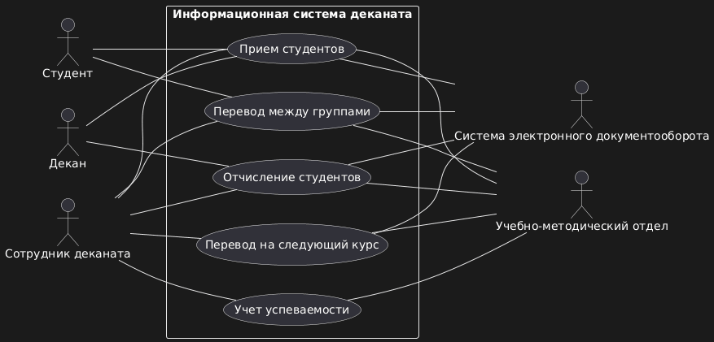

#Диаграмма прецедентов UML для информационной системы деканата



```plantuml
@startuml
skinparam packageStyle rect
left to right direction

:Декан:
:Сотрудник деканата:
:Преподаватель:
:Студент:

package "Информационная система деканата" {

(Прием студентов)
(Отчисление студентов)
(Учет успеваемости)
(Перевод между группами)
(Перевод на следующий курс)

}

:Сотрудник деканата: -- (Прием студентов)
:Сотрудник деканата: -- (Отчисление студентов)
:Сотрудник деканата: -- (Перевод между группами)
:Сотрудник деканата: -- (Перевод на следующий курс)

:Преподаватель: -- (Учет успеваемости)

:Декан: -- (Прием студентов)
:Декан: -- (Отчисление студентов)

:Студент: -- (Прием студентов)
:Студент: -- (Перевод между группами)

:Учебно-методический отдел:
:Система электронного документооборота:
:Бухгалтерия:

(Прием студентов) -- :Учебно-методический отдел:
(Прием студентов) -- :Система электронного документооборота:
(Прием студентов) -- :Бухгалтерия:
(Отчисление студентов) -- :Система электронного документооборота:
(Отчисление студентов) -- :Учебно-методический отдел:
(Отчисление студентов) -- :Бухгалтерия:
(Учет успеваемости) -- :Учебно-методический отдел:
(Перевод между группами) -- :Учебно-методический отдел:
(Перевод между группами) -- :Система электронного документооборота:
(Перевод на следующий курс) -- :Учебно-методический отдел:
(Перевод на следующий курс) -- :Система электронного документооборота:
@enduml```
