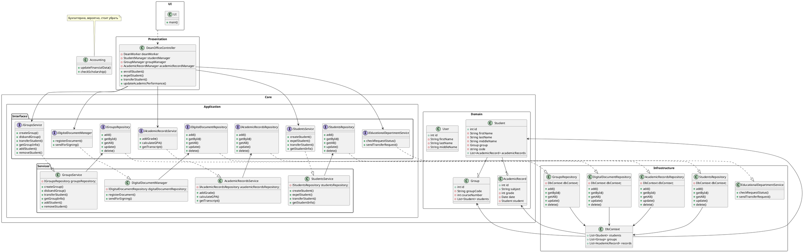

```plantuml
@startuml
class Accounting {
  + updateFinancialData()
  + checkScholarship()
}
note top of Accounting : Бухгалтерию, вероятно, стоит убрать

package Core <<Rectangle>> {
  package Domain <<Rectangle>> {
    class Group {
      + int id
      - String groupCode
      - int courseNumber
      - List<Student> students
    }
  
    class Student {
      + int id
      - String firstName
      - String lastName
      - String middleName
      - Group group
      - string code
      + List<AcademicRecord> academicRecords
    }
  
    class User {
      + int id
      - String firstName
      - String lastName
      - String middleName
    }
  
    class AcademicRecord {
      + int id
      + String subject
      - int grade
      - Date date
      - Student student
    }
  }
  
  package Application <<Rectangle>> {
    namespace Interfaces {
      interface IAcademicRecordsService {
        + addGrade()
        + calculateGPA()
        + getTranscript()
      }

      interface IEducationalDepartmentService {
        + checkRequestStatus()
        + sendTransferRequest()
      }
  
      interface IGroupsService {
        + createGroup()
        + disbandGroup()
        + transferStudent()
        + getGroupInfo()
        + addStudent()
        + removeStudent()
      }

      interface IDigitalDocumentManager {
        + registerDocument()
        + sendForSigning()
      }

      interface IStudentsService {
        + createStudent()
        + expelStudent()
        + transferStudent()
        + getStudentInfo()
      }

      interface IAcademicRecordsRepository {
        + add()
        + getById()
        + getAll()
        + update()
        + delete()
      }

      interface IGroupsRepository {
        + add()
        + getById()
        + getAll()
        + update()
        + delete()
      }

      interface IDigitalDocumentRepository {
        + add()
        + getById()
        + getAll()
        + update()
        + delete()
      }

      interface IStudentsRepository {
        + add()
        + getById()
        + getAll()
        + update()
        + delete()
      }
    }
    namespace Services {
      class AcademicRecordsService {
        - IAcademicRecordsRepository academicRecordsRepository;
        + addGrade()
        + calculateGPA()
        + getTranscript()
      }
  
      class GroupsService {
        - IGroupsRepository groupsRepository;
        + createGroup()
        + disbandGroup()
        + transferStudent()
        + getGroupInfo()
        + addStudent()
        + removeStudent()
      }
  
      class DigitalDocumentManager {
        - IDigitalDocumentRepository digitalDocumentRepository;
        + registerDocument()
        + sendForSigning()
      }
  
      class StudentsService {
        - IStudentsRepository studentsRepository;
        + createStudent()
        + expelStudent()
        + transferStudent()
        + getStudentInfo()
      }
    }
  }
}

package Infrastructure <<Rectangle>> {
  class DbContext {
    + List<Student> students
    + List<Group> groups
    + List<AcademicRecord> records
  }
  class AcademicRecordsRepository {
    - DbContext dbContext;
    + add()
    + getById()
    + getAll()
    + update()
    + delete()
  }

  class GroupsRepository {
    - DbContext dbContext;
    + add()
    + getById()
    + getAll()
    + update()
    + delete()
  }

  class DigitalDocumentRepository {
    - DbContext dbContext;
    + add()
    + getById()
    + getAll()
    + update()
    + delete()
  }

  class StudentsRepository {
    - DbContext dbContext;
    + add()
    + getById()
    + getAll()
    + update()
    + delete()
  }

  class EducationalDepartmentService {
    + checkRequestStatus()
    + sendTransferRequest()
  }
}

package Presentation <<Rectangle>> {
  class DeanOfficeController {
    - DeanWorker deanWorker
    - StudentManager studentManager
    - GroupManager groupManager
    - AcademicRecordManager academicRecordManager
    + enrollStudent()
    + expelStudent()
    + transferStudent()
    + updateAcademicPerformance()
  }
}

package UI <<Rectangle>> {
    class UI {
    + main()
  }
}

UI ..> DeanOfficeController

DeanOfficeController --> IStudentsService
DeanOfficeController --> IGroupsService
DeanOfficeController --> IAcademicRecordsService
DeanOfficeController --> IEducationalDepartmentService
DeanOfficeController --> IDigitalDocumentManager

IAcademicRecordsService ..|> AcademicRecordsService
IEducationalDepartmentService ..|> EducationalDepartmentService
IGroupsService ..|> GroupsService
IDigitalDocumentManager ..|> DigitalDocumentManager
IStudentsService ..|> StudentsService

IAcademicRecordsRepository ..|> AcademicRecordsRepository
IGroupsRepository ..|> GroupsRepository
IDigitalDocumentRepository ..|> DigitalDocumentRepository
IStudentsRepository ..|> StudentsRepository

AcademicRecordsRepository --> DbContext
GroupsRepository --> DbContext
DigitalDocumentRepository --> DbContext
StudentsRepository --> DbContext

AcademicRecordsService --> IAcademicRecordsRepository
GroupsService --> IGroupsRepository
DigitalDocumentManager --> IDigitalDocumentRepository
StudentsService --> IStudentsRepository

DbContext --> Student
DbContext --> Group
DbContext --> AcademicRecord

Student "1" --o "1" Group
Student "1" --o "n" AcademicRecord
@enduml
```