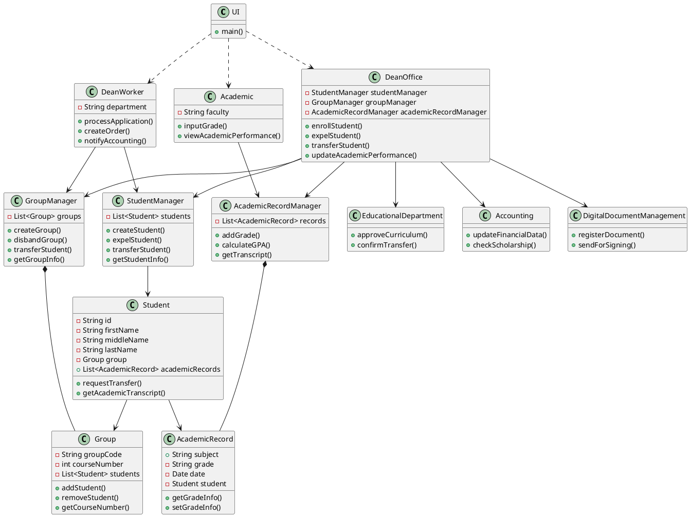

```plantuml
@startuml
class UI {
  + main()
}

class DeanOffice {
  - StudentManager studentManager
  - GroupManager groupManager
  - AcademicRecordManager academicRecordManager
  + enrollStudent()
  + expelStudent()
  + transferStudent()
  + updateAcademicPerformance()
}

class StudentManager {
  - List<Student> students
  + createStudent()
  + expelStudent()
  + transferStudent()
  + getStudentInfo()
}

class GroupManager {
  - List<Group> groups
  + createGroup()
  + disbandGroup()
  + transferStudent()
  + getGroupInfo()
}

class AcademicRecordManager {
  - List<AcademicRecord> records
  + addGrade()
  + calculateGPA()
  + getTranscript()
}

class Student {
  - String id
  - String firstName
  - String middleName
  - String lastName
  - Group group
  + List<AcademicRecord> academicRecords
  + requestTransfer()
  + getAcademicTranscript()
}

class Group {
  - String groupCode
  - int courseNumber
  - List<Student> students
  + addStudent()
  + removeStudent()
  + getCourseNumber()
}

class AcademicRecord {
  + String subject
  - String grade
  - Date date
  - Student student
  + getGradeInfo()
  + setGradeInfo()
}

class Academic {
  - String faculty
  + inputGrade()
  + viewAcademicPerformance()
}

class DeanWorker {
  - String department
  + processApplication()
  + createOrder()
  + notifyAccounting()
}


class EducationalDepartment {
  + approveCurriculum()
  + confirmTransfer()
}

class Accounting {
  + updateFinancialData()
  + checkScholarship()
}

class DigitalDocumentManagement {
  + registerDocument()
  + sendForSigning()
}

UI ..> DeanWorker
UI ..> Academic
UI ..> DeanOffice

DeanOffice --> StudentManager
DeanOffice --> GroupManager
DeanOffice --> AcademicRecordManager

StudentManager --> Student
GroupManager *-- Group
AcademicRecordManager *-- AcademicRecord

Student --> Group
Student --> AcademicRecord

Academic --> AcademicRecordManager
DeanWorker --> StudentManager
DeanWorker --> GroupManager

DeanOffice --> EducationalDepartment
DeanOffice --> Accounting
DeanOffice --> DigitalDocumentManagement
@enduml
```
