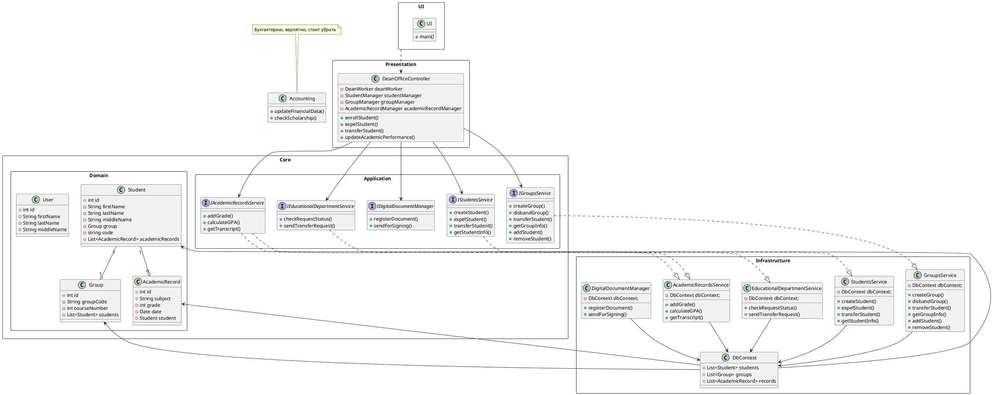

```plantuml
@startuml
class Accounting {
  + updateFinancialData()
  + checkScholarship()
}
note top of Accounting : Бухгалтерию, вероятно, стоит убрать

package Core <<Rectangle>> {
  package Domain <<Rectangle>> {
    class Group {
      + int id
      - String groupCode
      - int courseNumber
      - List<Student> students
    }
  
    class Student {
      + int id
      - String firstName
      - String lastName
      - String middleName
      - Group group
      - string code
      + List<AcademicRecord> academicRecords
    }
  
    class User {
      + int id
      - String firstName
      - String lastName
      - String middleName
    }
  
    class AcademicRecord {
      + int id
      + String subject
      - int grade
      - Date date
      - Student student
    }
  }
  
  package Application <<Rectangle>> {
    interface IAcademicRecordsService {
      + addGrade()
      + calculateGPA()
      + getTranscript()
    }

    interface IEducationalDepartmentService {
      + checkRequestStatus()
      + sendTransferRequest()
    }

    interface IGroupsService {
      + createGroup()
      + disbandGroup()
      + transferStudent()
      + getGroupInfo()
      + addStudent()
      + removeStudent()
    }

    interface IDigitalDocumentManager {
      + registerDocument()
      + sendForSigning()
    }

    interface IStudentsService {
      + createStudent()
      + expelStudent()
      + transferStudent()
      + getStudentInfo()
    }
  }
}

package Infrastructure <<Rectangle>> {
  class DbContext {
    + List<Student> students
    + List<Group> groups
    + List<AcademicRecord> records
  }

  class AcademicRecordsService {
    - DbContext dbContext;
    + addGrade()
    + calculateGPA()
    + getTranscript()
  }

  class EducationalDepartmentService {
    - DbContext dbContext;
    + checkRequestStatus()
    + sendTransferRequest()
  }

  class GroupsService {
    - DbContext dbContext;
    + createGroup()
    + disbandGroup()
    + transferStudent()
    + getGroupInfo()
    + addStudent()
    + removeStudent()
  }

  class DigitalDocumentManager {
    - DbContext dbContext;
    + registerDocument()
    + sendForSigning()
  }

  class StudentsService {
    - DbContext dbContext;
    + createStudent()
    + expelStudent()
    + transferStudent()
    + getStudentInfo()
  }
}

package Presentation <<Rectangle>> {
  class DeanOfficeController {
    - DeanWorker deanWorker
    - StudentManager studentManager
    - GroupManager groupManager
    - AcademicRecordManager academicRecordManager
    + enrollStudent()
    + expelStudent()
    + transferStudent()
    + updateAcademicPerformance()
  }
}

package UI <<Rectangle>> {
    class UI {
    + main()
  }
}

UI ..> DeanOfficeController

DeanOfficeController --> IStudentsService
DeanOfficeController --> IGroupsService
DeanOfficeController --> IAcademicRecordsService
DeanOfficeController --> IEducationalDepartmentService
DeanOfficeController --> IDigitalDocumentManager

IAcademicRecordsService ..|> AcademicRecordsService
IEducationalDepartmentService ..|> EducationalDepartmentService
IGroupsService ..|> GroupsService
IAcademicRecordsService ..|> AcademicRecordsService
IStudentsService ..|> StudentsService

AcademicRecordsService --> DbContext
EducationalDepartmentService --> DbContext
GroupsService --> DbContext
DigitalDocumentManager --> DbContext
StudentsService --> DbContext

DbContext --> Student
DbContext --> Group
DbContext --> AcademicRecord

Student "1" --o "1" Group
Student "1" --o "n" AcademicRecord
@enduml
```