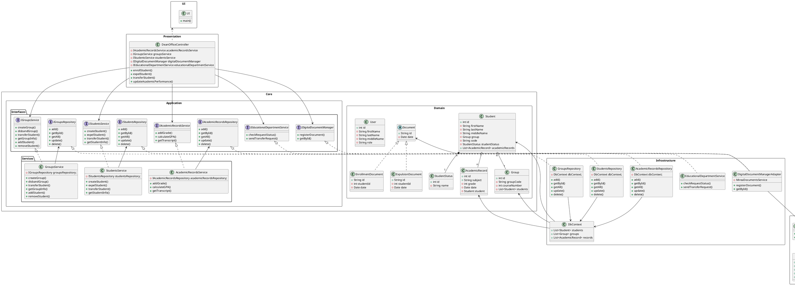

```plantuml
@startuml

package Core <<Rectangle>> {
  package Domain <<Rectangle>> {
    class Group {
      + int id
      - String groupCode
      - int courseNumber
      - List<Student> students
    }
  
    class Student {
      + int id
      - String firstName
      - String lastName
      - String middleName
      - Group group
      - String code
      - StudentStatus studentStatus
      + List<AcademicRecord> academicRecords
    }

    class StudentStatus {
      + int id
      - String name
    }

    abstract class Document {
      + String id
      - Date date
    }

    class EnrollmentDocument {
      + String id
      - int studentId
      - Date date
    }

    class ExpulsionDocument {
      + String id
      - int studentId
      - Date date
    }

    class User {
      + int id
      - String firstName
      - String lastName
      - String middleName
      - String role
    }
  
    class AcademicRecord {
      + int id
      + String subject
      - int grade
      - Date date
      - Student student
    }
  }
  
  package Application <<Rectangle>> {
    namespace Interfaces {
      interface IAcademicRecordsService {
        + addGrade()
        + calculateGPA()
        + getTranscript()
      }

      interface IEducationalDepartmentService {
        + checkRequestStatus()
        + sendTransferRequest()
      }
  
      interface IGroupsService {
        + createGroup()
        + disbandGroup()
        + transferStudent()
        + getGroupInfo()
        + addStudent()
        + removeStudent()
      }

      interface IDigitalDocumentManager {
        + registerDocument()
        + getById()
      }

      interface IStudentsService {
        + createStudent()
        + expelStudent()
        + transferStudent()
        + getStudentInfo()
      }

      interface IAcademicRecordsRepository {
        + add()
        + getById()
        + getAll()
        + update()
        + delete()
      }

      interface IGroupsRepository {
        + add()
        + getById()
        + getAll()
        + update()
        + delete()
      }

      interface IStudentsRepository {
        + add()
        + getById()
        + getAll()
        + update()
        + delete()
      }
    }
    namespace Services {
      class AcademicRecordsService {
        - IAcademicRecordsRepository academicRecordsRepository;
        + addGrade()
        + calculateGPA()
        + getTranscript()
      }
  
      class GroupsService {
        - IGroupsRepository groupsRepository;
        + createGroup()
        + disbandGroup()
        + transferStudent()
        + getGroupInfo()
        + addStudent()
        + removeStudent()
      }

      class StudentsService {
        - IStudentsRepository studentsRepository;
        + createStudent()
        + expelStudent()
        + transferStudent()
        + getStudentInfo()
      }
    }
  }
}

package Infrastructure <<Rectangle>> {
  class DbContext {
    + List<Student> students
    + List<Group> groups
    + List<AcademicRecord> records
  }
  class AcademicRecordsRepository {
    - DbContext dbContext;
    + add()
    + getById()
    + getAll()
    + update()
    + delete()
  }

  class GroupsRepository {
    - DbContext dbContext;
    + add()
    + getById()
    + getAll()
    + update()
    + delete()
  }

  class StudentsRepository {
    - DbContext dbContext;
    + add()
    + getById()
    + getAll()
    + update()
    + delete()
  }

  class EducationalDepartmentService {
    + checkRequestStatus()
    + sendTransferRequest()
  }

  class DigitalDocumentManagerAdapter {
    - MireaDocumentsService
    + registerDocument()
    + getById()
  }
}

package Presentation <<Rectangle>> {
  class DeanOfficeController {
    - IAcademicRecordsService academicRecordsService
    - IGroupsService groupsService
    - IStudentsService studentsService
    - IDigitalDocumentManager digitalDocumentManager
    - IEducationalDepartmentService educationalDepartmentService
    + enrollStudent()
    + expelStudent()
    + transferStudent()
    + updateAcademicPerformance()
  }
}

package UI <<Rectangle>> {
    class UI {
    + main()
  }
}

package MireaLib <<Rectangle>> {
  class DocumentDetails {
    + int id
    + string content
    + int? studentId
    + Date date
    + string documentType
  }

  class CreateDocumentRequest {
    + int id
    + int? studentId
    + Date date
    + string documentType
  }

  class MireaDocumentsService {
    + createDocument()
    + getDetailsById()
  }
}

MireaDocumentsService --> CreateDocumentRequest
MireaDocumentsService --> DocumentDetails

UI <.. DeanOfficeController

DeanOfficeController --> IStudentsService
DeanOfficeController --> IGroupsService
DeanOfficeController --> IAcademicRecordsService
DeanOfficeController --> IEducationalDepartmentService
DeanOfficeController --> IDigitalDocumentManager

IAcademicRecordsService <|.. AcademicRecordsService
IEducationalDepartmentService <|.. EducationalDepartmentService
IGroupsService <|.. GroupsService
IDigitalDocumentManager <|.. DigitalDocumentManagerAdapter
IStudentsService <|.. StudentsService

IAcademicRecordsRepository <|.. AcademicRecordsRepository
IGroupsRepository <|.. GroupsRepository
IStudentsRepository <|.. StudentsRepository

AcademicRecordsRepository --> DbContext
GroupsRepository --> DbContext
StudentsRepository --> DbContext
DigitalDocumentManagerAdapter --> MireaDocumentsService
DigitalDocumentManagerAdapter --> Document

DbContext --> Student
DbContext --> Group
DbContext --> AcademicRecord

AcademicRecordsService --> IAcademicRecordsRepository
GroupsService --> IGroupsRepository
StudentsService --> IStudentsRepository

Student "n" o-- "1" Group
Student "1" o-- "n" AcademicRecord
Student "n" *-- "1" StudentStatus

Document <|.. EnrollmentDocument
Document <|.. ExpulsionDocument
@enduml
```
